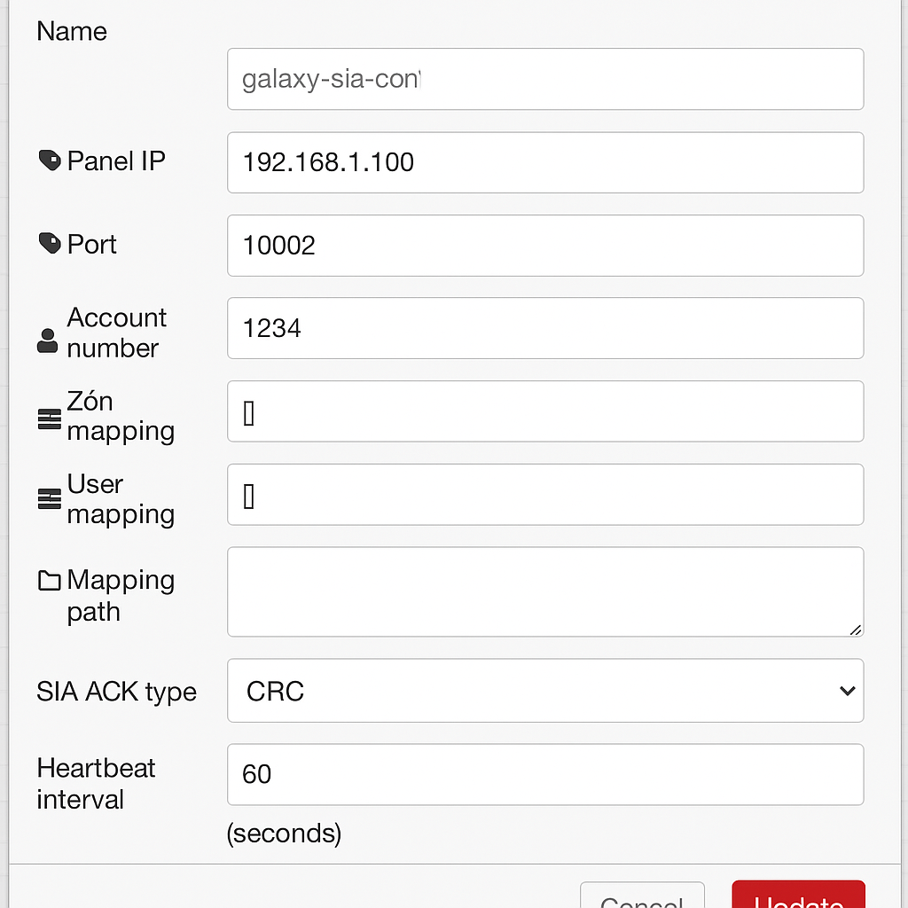

# node-red-contrib-galaxy-sia

Node-RED SIA DC-09 integration for Honeywell Galaxy Dimension.

---

## Grafická nápověda: Uzly v Node-RED

### 1. Konfigurační uzel `galaxy-sia-config`


- Tento node nastavuje parametry TCP serveru, účtu, mapování a ACK.
- V projektu je pouze jeden na všechny instance příjmových uzlů.
- **Pole**:
  - IP adresa, port, account (účtu), SIA úroveň
  - Mapování zón, uživatelů, oblastí (staticky nebo dynamicky z externího souboru)
  - Volba typu ACK odpovědi

---

### 2. Vstupní uzel `galaxy-sia-in`


- Tento node přijímá zprávy z panelu Galaxy Dimension (TCP server).
- **Vstupy**: Nemá vstup (je pouze receiver).
- **Výstupy**:
  - **1. výstup**: hlavní zpráva (zpracovaná, obsahuje naparsovanou událost a mapování)
  - **2. výstup**: debug nebo chybové zprávy (raw zpráva, parsing error, warning...)

---

### 3. Typické schéma v Node-RED


- `galaxy-sia-config` je připojen ke všem instancím `galaxy-sia-in`.
- Výstup z `galaxy-sia-in` můžete napojit například na:
  - funkční node (zpracování událostí)
  - upozornění (e-mail, SMS, MQTT)
  - databázi (MongoDB, InfluxDB)
  - debug node pro ladění

---

## Jak to vypadá v editoru

**Konfigurační node:**


**Vstupní node a výstupy:**


---

## Popis výstupních zpráv

**První výstup (hlavní zpráva):**
```json
{
  "zone": "1",
  "zoneName": "Sklad",
  "user": "007",
  "userName": "Petr Novák",
  "area": "1",
  "areaName": "Hala",
  "event": "OPN",
  "ack": "<ACK packet>",
  "raw": "<původní SIA zpráva>",
  ...
}
```

**Druhý výstup (debug/chyby):**
```json
{
  "raw": "<původní zpráva>",
  "parsed": { ... },
  "ack": "<ACK packet>",
  "zoneName": "...",
  "userName": "...",
  "areaName": "...",
  "error": "<popis chyby – pouze při chybě>"
}
```

---

## Poznámky k obrázkům

Obrázky najdete ve složce `/docs/` tohoto repozitáře. Pokud používáte vlastní instalaci, můžete si je vytvořit screenshotem vašeho flow v Node-RED.

---

## Další informace

Podrobný popis konfigurace, dynamického mapování a troubleshooting najdete v dalších sekcích tohoto README.

---
